# SpainNBass Frontend


### OBJETIVO :dart:

El objetivo de este proyecto es recrear el frontend de una web-comunidad donde los fans del drum and bass (dnb) compartan información y opiniones sobre los temas en torno a este género musical.

### INDICE :open_file_folder: 
- [SpainNBass Frontend](#spainnbass-frontend)
    - [OBJETIVO :dart:](#objetivo-dart)
    - [INDICE :open\_file\_folder:](#indice-open_file_folder)
    - [TECNOLOGIAS :wrench:](#tecnologias-wrench)
    - [SOBRE LA APP :blue\_book:](#sobre-la-app-blue_book)
    - [DIAGRAMA DB :clipboard:](#diagrama-db-clipboard)
    - [COMO DESCARGAR Y PROBARLO :mag:](#como-descargar-y-probarlo-mag)
    - [DISEÑO DEL FRONT :computer:](#diseño-del-front-computer)
    - [AUTHOR :pencil2:](#author-pencil2)
    - [FUTURAS MEJORAS :heavy\_check\_mark:](#futuras-mejoras-heavy_check_mark)
    - [BUGS :bug:](#bugs-bug)
    - [AGRADECIMIENTOS :raised\_hands:](#agradecimientos-raised_hands)

### TECNOLOGIAS :wrench:


### SOBRE LA APP :blue_book:

Este proyecto de front permite tanto crear un usuario como loguerase en el mismo y configurar tu perfil de fan del dnb. Se pueden llevar a cabo distintas funciones:

- Registro y login en tu usuario para leer las noticias mas recientes del género en el país
- Consulta los diferentes apartados del foro donde pobras encontrar posts de mas a menos recientes ordenados con opiniones centradas en el tipo de subgenero que mas te gusta
- Crea nuevos posts en la categoria que quieras. tambien tenemos una exclusivamente para memes y echarse unas risas!
- Consulta tus posts creados o modifica tus datos personales o sobre tus gustos en la vista "Mi perfil"
- Lee, edita y borra tus posts Tambén puedes dar me gusta a todos los posts y comentar en ellos entrando a su vista en detalle.
- See any post in detail and edit your own posts content in profile.
- Consultar y borrar todos los usuarios y posibilidad de borrarlos individualmente.(super_admin)
- Posibilidad de borrar un post cualquiera desde la vista en detalle del mismo(super_admin)
- Vista detalle de las nociticas donde consultar en detalle la información de eventos o noticias.


### DIAGRAMA DB :clipboard:

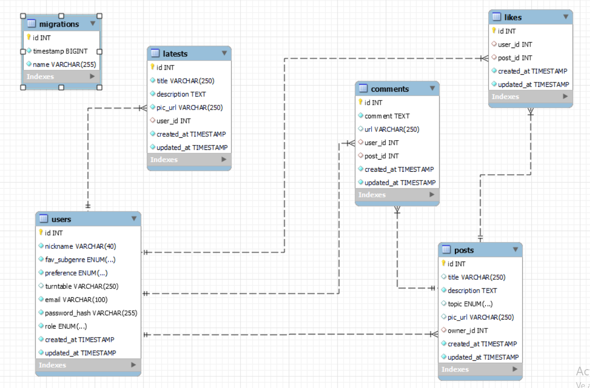

### COMO DESCARGAR Y PROBARLO :mag: 

Aquí puedes encontrar el link al repositorio

- https://github.com/MR-ant1/Front-SpainNBass.git

y aquí mas abajo, el link al repositorio que contiene el backend de este proyecto full stack:

- https://github.com/MR-ant1/API-SpainNBass.git

Sigue estos pasos para correr esta parte front:

<details>
<summary>INSTRUCCIONES</summary>

1. Crea una carpeta para el proyecto. Abrela con visual studio y lanza los siguientes comandos:
``` bash
git init
```
una vez hecho esto, introducimos "git clone https://github.com/MR-ant1/Front-SpainNBass.git"

1.     Después abrimos la consola y escribimos estos comandos para instalar dependencias y correr el servidor:
``` bash
npm i
```
``` bash
npm run dev
```
1.  Aqui se facilitan dos usuarios para utilizar la web como usuario estandar o super_admin
```bash
admin@admin.com
superadmin@superadmin.com
```

</details>

### DISEÑO DEL FRONT :computer:

En primer lugar se ejecutó el comando npm create vite@latest y se creó la estructura básica del frontend

Se importa BrowserRouter para permitir navegar entre diferentes vistas que se crearán después

También se añadió Provider y PersistGate para permitir funcionar correctamente redux


Después, se creó la variable app para asociarla a express, de esta forma podremos levantar el servidor.

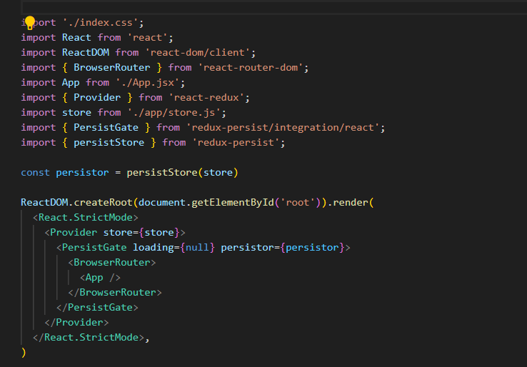

"app" contendrá las secciones principales de nuestra pantalla, Cuerpo y Encabezado. Este archivo controlará la visualización web y permitirá agregar propiedades y diseños a ambas secciones más adelante.

Una vez que hayamos creado el archivo de nuestra aplicación, agregamos los archivos "Cuerpo" y "Encabezado" para definir lo que estas secciones tendrán que mostrar. Primero su archivo Body, que no contiene datos de diseño y solo tiene las diferentes rutas de cada página para navegar. Entonces encontramos que el cuerpo actúa como un enrutador que mostrará una vista dependiendo de la ruta que tengamos en nuestra URL.

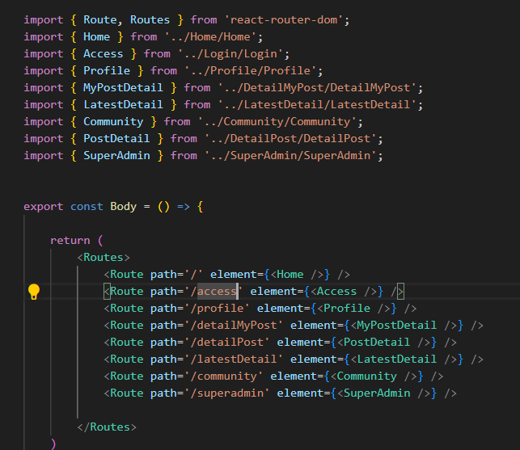

Puedes ver en la imagen todas las diferentes vistas que puede mostrar este frente y sus rutas para navegar. Tenga en cuenta que la primera Ruta se introduce para reubicar cualquier otra ruta no descrita en este archivo a la página de inicio con la ruta "/".

Luego, se crea el encabezado. Esta sección se mostrará siempre en nuestra web para permitir moverse a todas las secciones.

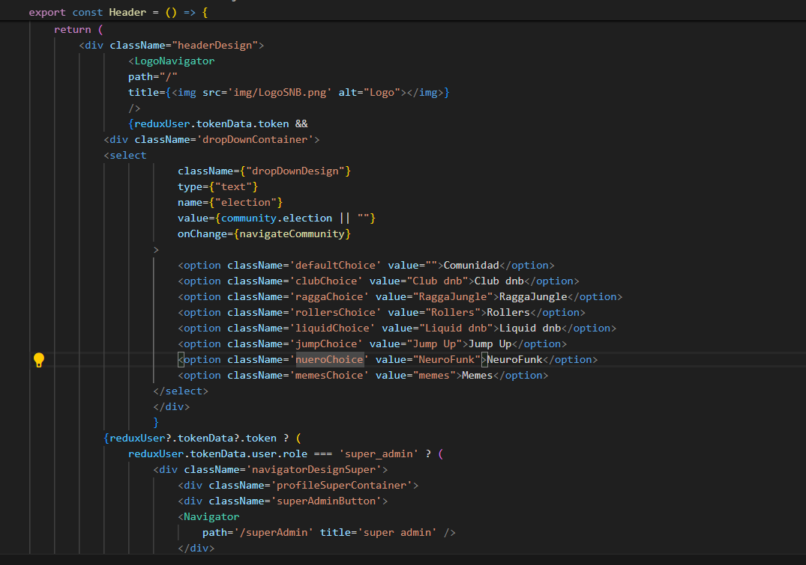

En esta foto de la primera parte del encabezado, podemos ver cómo se trae tokenData para permitir mostrar uno de dos posibles encabezados y cómo se define la función cerrar sesión para hacer que este botón elimine el token y salga de un usuario registrado. También podemos ver la visualización del encabezado para los casos en los que el usuario posee un tokenData del inicio de sesión anterior. En este caso, todas las secciones de usuario se mostrarán en el encabezado (mi perfil, categorías del foro cerrar sesión y, si el usuario es super_admin, la sección "área de administración" para ver todos los usuarios).

Si el usuario no posee un token, cuando lo que el usuario verá son las secciones de inicio y el apartado de acceso.
La página de inicio se encuentra al comienzo del retorno y está fuera de condiciones porque se mostrará siempre sin importar si el usuario posee un token o no.

Para que las rutas del cuerpo funcionen, necesitaremos BrowserRoutes que definimos antes y el archivo Navigator que contiene la lógica para cambiar una página dependiendo de la instrucción "enviar a" de la nueva página seleccionada.

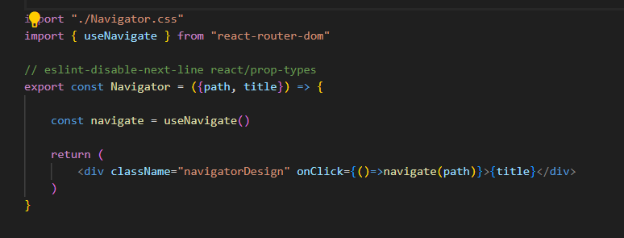

Esto permite invocar la variable de navegación que envía a la ruta que damos dentro ("/")

Una vez que tenemos la estructura principal de nuestra web hecha, añadimos diseños css a todos estos componentes anteriores de la página para poder evaluar si funciona correctamente.

El trabajo restante consiste en implementar páginas y lógica para hacerlas funcionar. A continuación describiré cada uno de ellos.

<details>
<summary>VISTAS</summary>

---------------------------------------------

<details>
<summary>REGISTRO/LOGIN</summary>

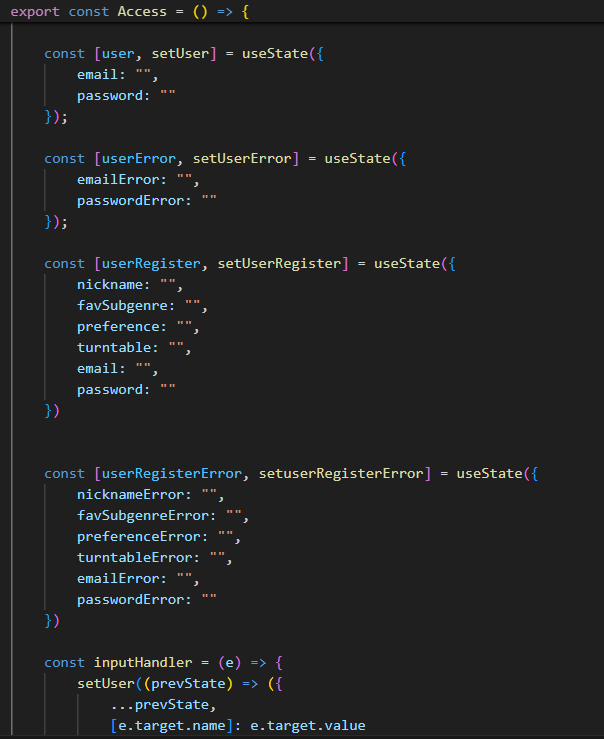

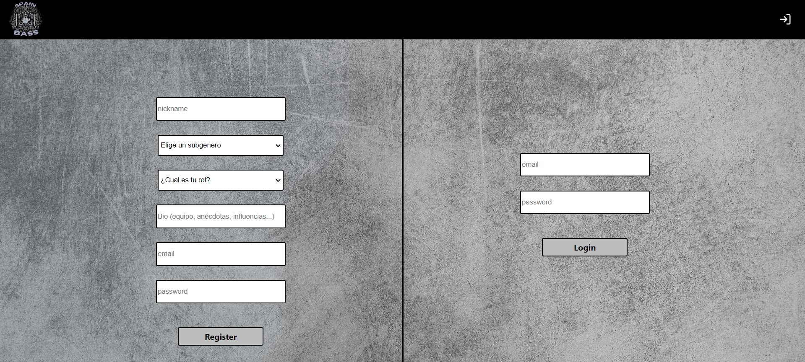

En la página de registro e inicio de sesión, creamos una función donde primero se definen todas las funciones de usuario, error y acción, y luego, en el retorno, se lanzan 4 entradas y un botón personalizado para registro, y en la otra mitad de la pantalla, los dos inputs con su botón para iniciar sesión

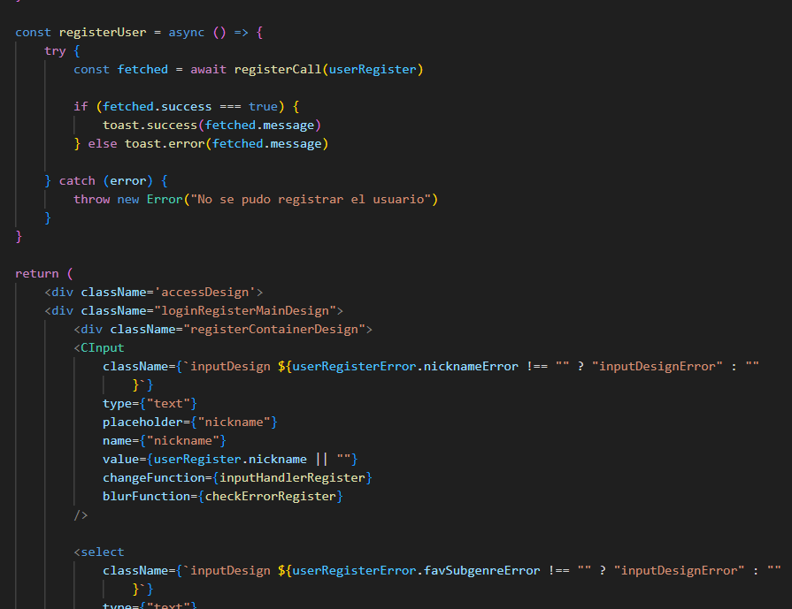

La función InputHandler hace que las entradas puedan cambiar dinámicamente mientras alguien escribe cada valor clave del objeto de usuario. Se da el mismo uso de InputHandler para verificar cualquier error cuando salimos del campo. Ambas funciones están definidas en nuestro modelo CIunput:

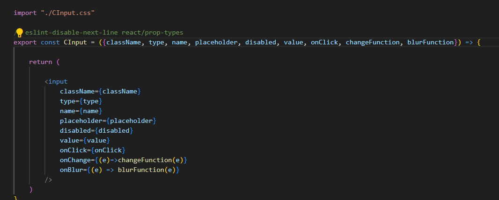

Hay algunas entradas diferentes para otras vistas, pero todas funcionan de la misma manera.

OnChangeFunction contiene la funcionalidad de cambio de escritura y onBlurFunction, el evento de error de verificación al salir de cada campo.

Finalmente, el CButton contiene la función de "registro", lo que hace que se ejecute cuando hacemos clic en este componente.

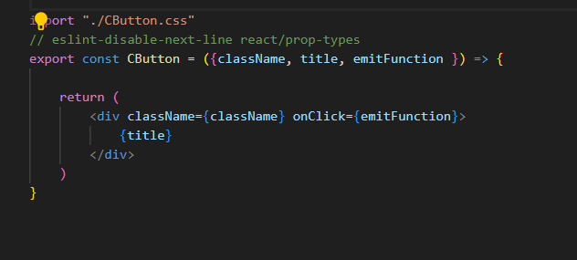


Login use a similar structure with a function that contains user data in an object to send to backend four fields with the same structure we prepared in there. InputHandler function and checkerror are included too for fields email and password from user.

USE THE PASSWORD aA123456 FOR ALL USERS IN DB


Same hooks and consts alike in Register are declared, and then inputhandler and checkerror for inputs.

La función loginMe envía al archivo api.calls los datos introducidos en los inputs (después de que cada campo pase su función checkError), y allí LoginUser realiza la conexión con el backend y envía datos JSON.

Luego, si accessData es correcto, la respuesta del backend contiene la información del token que se guarda en nuestra variable tokenData en el almacenamiento local. Así es como podremos obtener el nombre, la identificación y la función del usuario en otras páginas.

In api.calls, the function LoginUser defines a clientData variable with the required formatted data needed our backend's client. (in this case method, headers and body with inputs data from register page).

With al this functionality, Login throws two fields and a register me button, with same structure that in register.

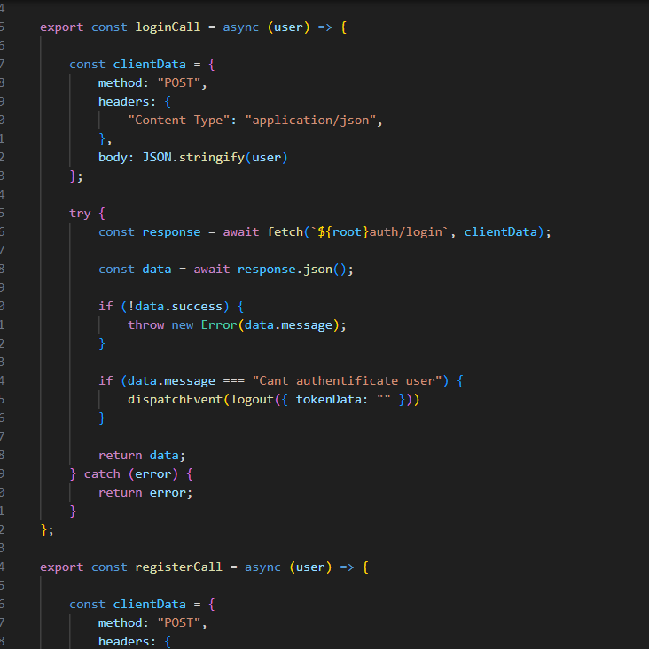

-----------------------------------------

</details>

<details>
<summary>PROFILE</summary>


La página de perfil funciona de manera similar a la página de inicio de sesión y registro, generando 3 entradas con información de usuario extraída de la base de datos con la función useEffect cuando se carga la página. La principal diferencia es la nueva función Upload que envía nuevos datos ingresados en inputs como otros pero usando un método PUT para cargar valores en DB.
El campo de correo electrónico no es editable, por lo que se agregó un accesorio deshabilitado para no permitir esta acción.
En la otra mitad de la pantalla, aparecen las publicaciones de su usuario y puede editarlas o eliminarlas una por una.

-----------------------------------------

</details>

<details>
<summary>HOME</summary>

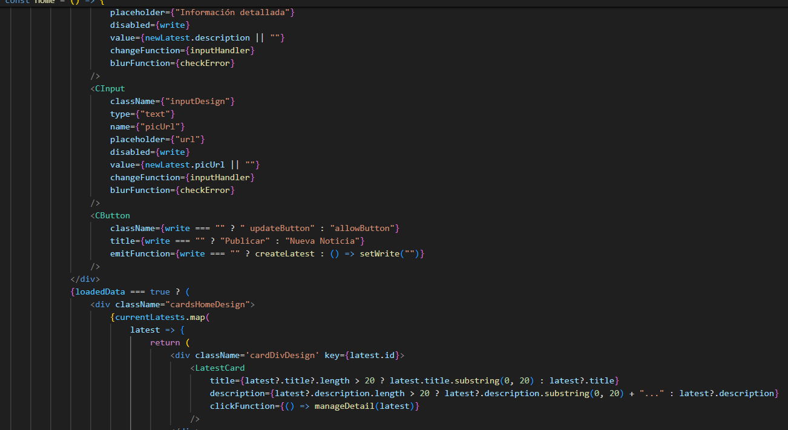

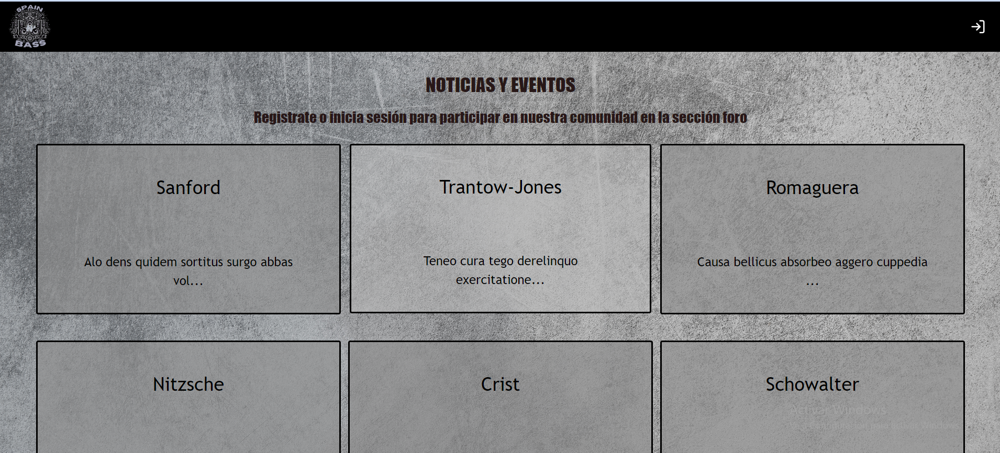

Esta página actúa como la página de inicio a la que accede el usuario por primera vez y como fuente para escribir nuevas publicaciones y leer el resto. Si el usuario no ha iniciado sesión, la vista mostrará la primera y se podrá realizar cualquier acto excepto iniciar sesión y registrarse.

La primera parte de la función de inicio es diferente y no necesita la función inputHandler. Agregamos un useEffect para ejecutar la función OBTENER datos de servicios al cargar la página. getServices funciona casi como las funciones anteriores de inicio de sesión y registro enviando datos a api.calls y luego al backend.

La principal diferencia en esta y otras páginas es que return no arroja entradas. Esta vez, los datos de servicios se definen como una matriz vacía y, a cambio, un método de mapa itera una tarjeta para cada objeto traído por la base de datos con claves definidas en el componente de tarjeta previamente definido en su propio archivo:

Además, a cada tarjeta se le puede dar me gusta haciendo clic en el ícono del corazón o acceder a la vista detallada haciendo clic en la tarjeta misma.

El cuadro de arriba en el feed es donde podemos crear una nueva publicación con un título y una descripción.

-----------------------------------------

</details>

<details>
<summary>VISTAS DETAIL</summary>

In home view and profile too, you can click in cards and go to their detail page. There you'll be able to see full info from any post and, in case of profile own post, edit them. 

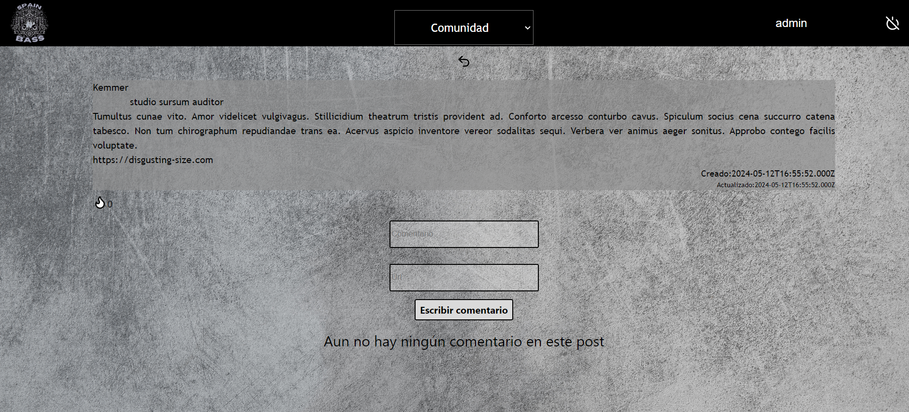

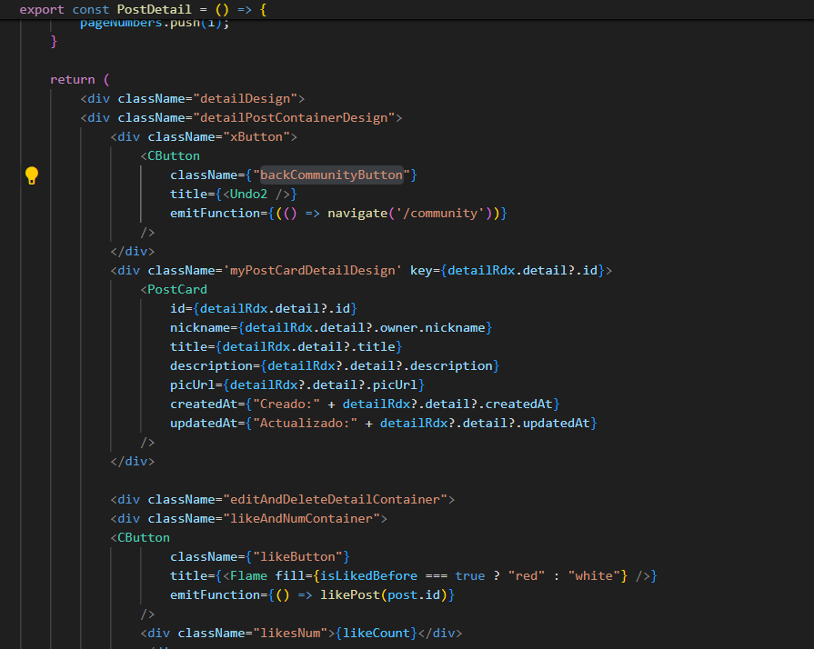

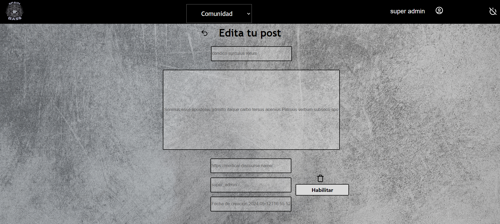

---------------------------------------------------

</details>


<details>
<summary>SUPER ADMIN</summary>

Funciona como un feed con un mapa iterando tarjetas, pero esta vez todos los usuarios se obtienen desde la base de datos y solo super_admin (acceso controlado al comienzo de la función) puede acceder.

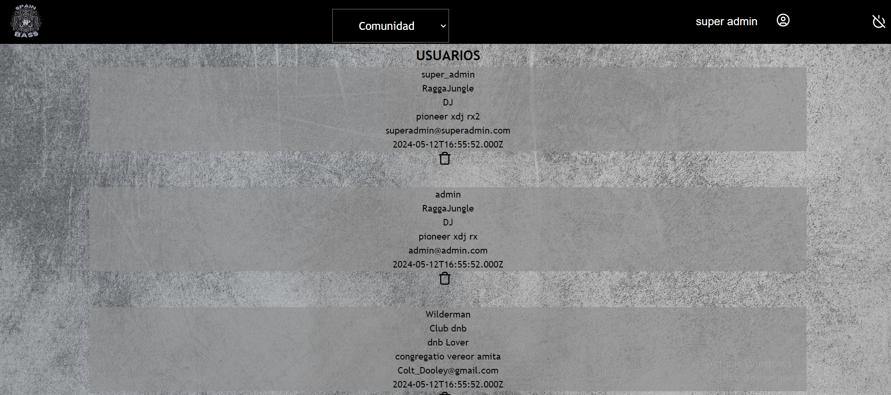

---------------------------------------------------

</details>

</details>

###  AUTHOR :pencil2:
- Antonio Rodrigo - Full Stack Developer student

- <a href="https://github.com/MR-ant1">GitHub - <a>in/antonio-rodrigo-camacho</a>

### FUTURAS MEJORAS :heavy_check_mark: 

- Introducir función de insertar imágenes bien via enlace o subiendo el archivo en binario
- Implementación de otra sección con información al respecto de colectivos y asociaciones de España que promuevan la cultura.
- Implementar spinner para los momentos de carga
- Corregir formato de inputs para que el texto no desborde los mismos.
- Diseño dinámico del background de mi perfil según la eleccion del usuario en su subgenero favorito

### BUGS :bug: 

- Al salir de la cuenta en la vista postDetail, surge un bug que deja al usuario sin posibilidad de navegar en la página.
- Al crear un nuevo post y, si no se recarga página. El nombre de usuario creador del mismo en la feed no aparecerá hasta que se navegue a otra página o se recargue la vista y se haga llamada al back
- Si en la vista community, algún apartado no dispone de posts, crashea la aplicación. De momento solucionado con seeders de post para cada categoría

### AGRADECIMIENTOS :raised_hands:
Muchisimas gracias al equipo de GeeksHubs Achademy por hacer posible mi andanza y desarrollo en este fantástico mundo del desarrollo!
Espaciales agradecimientos a todos mis compañeros que siempre están ahi para una ayuda!!


[def]: #Agradecimientos-

:arrow_up: [TABLE OF CONTENTS](#TABLE_OF_CONTENTS-open_file_folder)